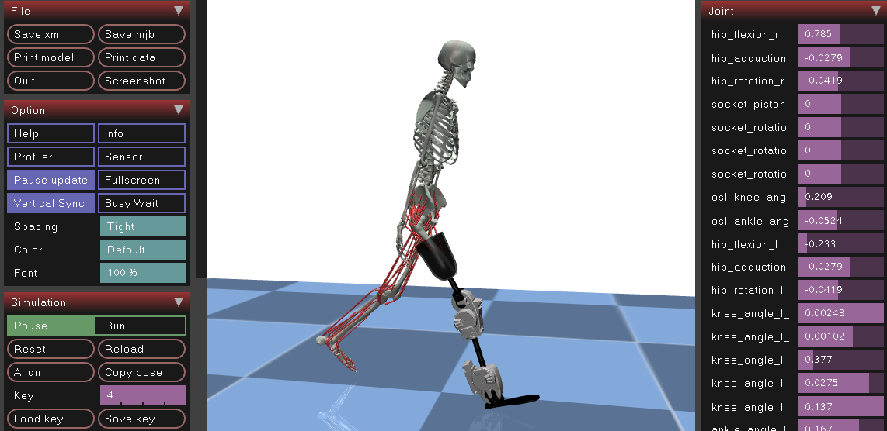

# Musculoskeletal Modeling

This section covers the modeling aspects of MyoAssist, including available models and model preparation.

  

## Available Models

MyoAssist supports multiple musculoskeletal models:

- **22-muscle 2D models**: Basic 2D models for initial testing
- **26-muscle 3D models**: More complex 3D models
- **80-muscle models**: Full complexity models for advanced research

## Model Preparation

Learn how to prepare and configure your models for simulation.

## Quick Links

- [Available Models](Available_Models)
- [Modeling Guide](Modeling)
- [Model Preparation](model_prep)
